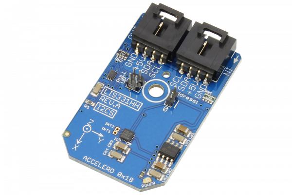

[](https://store.ncd.io/product/lis331hh-mems-motion-sensor-ultra-low-power-full-scale-3-axis-accelerometer-i2c-mini-module/).

# LIS331HH

Manufactured by STMicroelectronics, the LIS331HH is an ultra low-power high performance accelerometer belonging to the “nano” family, with a digital I2C output.The LIS331HH has dynamically user-selectable full scales of ±6g/±12g/±24g and it is capable of measuring accelerations with output data rates from 0.5 Hz to 1 kHz. 
This Device is available from www.ncd.io

[SKU: LIS331HH]

(https://store.ncd.io/product/lis331hh-mems-motion-sensor-ultra-low-power-full-scale-3-axis-accelerometer-i2c-mini-module/)
This Sample code can be used with Raspberry Pi.

Hardware needed to interface LIS331HH 3axis accelometer sensor With Raspberry Pi :

1. <a href="https://store.ncd.io/product/lis331hh-mems-motion-sensor-ultra-low-power-full-scale-3-axis-accelerometer-i2c-mini-module/">LIS331HH ultra low power 3axis accelometer sensor</a>

2. <a href="https://store.ncd.io/product/i2c-shield-for-raspberry-pi-3-pi2-with-outward-facing-i2c-port-terminates-over-hdmi-port/">Raspberry Pi I2C Shield</a>

3. <a href="https://store.ncd.io/product/i%C2%B2c-cable/">I2C Cable</a>

## Python

Download and install smbus library on Raspberry pi. Steps to install smbus are provided at:

https://pypi.python.org/pypi/smbus-cffi/0.5.1

Download (or git pull) the code in pi. Run the program.

```cpp
$> python LIS331HH.py
```
The lib is a sample library, you will need to calibrate the sensor according to your application requirement.
